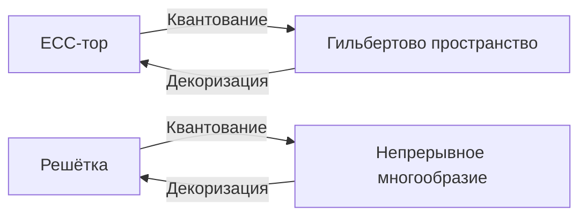

### Общая теория криптографических многообразий (КТМ)

#### **1. Базовые определения**
**Криптографическое многообразие** — тройка \(( \mathcal{M}, \mathcal{F}, \mathcal{S} )\), где:
- \(\mathcal{M}\) — гладкое многообразие (пространство состояний)
- \(\mathcal{F}\) — пучок вычислительных операций
- \(\mathcal{S}\) — стратификация безопасности (разбиение на классы эквивалентности)

---

#### **2. Унификация парадигм**
| Парадигма       | \(\mathcal{M}\)                  | \(\mathcal{F}\)                     | \(\mathcal{S}\)                     |
|------------------|----------------------------------|-------------------------------------|-------------------------------------|
| **ECC**          | Тор \(\mathbb{T}^2 = S^1 \times S^1\) | Скалярное умножение: \([k]: P \mapsto kP\) | Страты: \(\\{ \Gamma_d \mid d \in \mathbb{Z}_n \\}\) |
| **Решётки**      | Факторпространство \(\mathbb{R}^m/\Lambda\) | Базисная редукция: \(\text{LLL}(\mathbf{B})\) | Вороного-ячейки \(\mathcal{V}(\mathbf{v})\) |
| **ZKP**          | Арифметическая схема \(\mathcal{A}\) | R1CS-ограничения: \(\mathbf{A}z \circ \mathbf{B}z = \mathbf{C}z\) | Ядро: \(\ker(\mathbf{A})\) |
| **Квантовые схемы** | Гильбертово пространство \(\mathcal{H}\) | Унитарные операторы: \(U|\psi\rangle\) | Подпространства: \(\mathcal{H}_0 \oplus \mathcal{H}_1\) |

---

#### **3. Топологические инварианты безопасности**
Инвариант \( \mathcal{I}(\mathcal{M}) \) определяет криптостойкость:
```math
\mathcal{I}(\mathcal{M}) = \int_{\mathcal{M}} \kappa  d\mu + \dim H_1(\mathcal{M}, \mathbb{Z})
```
где:
- \(\kappa\) — скалярная кривизна
- \(H_1\) — первая группа гомологий

**Специализация:**
- **ECC**: \(\mathcal{I}(\mathbb{T}^2) = |\det(\text{End}(E))|\) (модулярный инвариант)
- **Решётки**: \(\mathcal{I}(\mathbb{R}^m/\Lambda) = \lambda_1(\Lambda)\) (длина кратчайшего вектора)
- **ZKP**: \(\mathcal{I}(\mathcal{A}) = \dim \ker(\mathbf{A})\) (размерность ядра)
- **Кванты**: \(\mathcal{I}(\mathcal{H}) = \| \Pi_0 - \Pi_1 \|\) (норма проекторов)

---

#### **4. Геодезическая модель атак**
Атака — поиск геодезической \(\gamma: [0,1] \to \mathcal{M}\) между целевыми точками:
```math
\nabla_{\dot{\gamma}}\dot{\gamma} = 0, \quad \gamma(0) = P,  \gamma(1) = Q
```
**Примеры:**
- **ECDSA**: Поиск коллизий вдоль \(\Delta uz + d \cdot \Delta ur = 0\)
- **Regev-LWE**: Минимизация \(\|\mathbf{s}\|\) в \(\mathbf{A}\mathbf{s} = \mathbf{t} \mod q\)
- **zk-SNARK**: Поиск свидетеля в \(\text{span}(\ker \mathbf{A})\)

---

#### **5. Фундаментальные теоремы**
**Теорема 1 (Эквивалентность уязвимостей)**  
Уязвимости во всех парадигмах соответствуют сингулярным стратам \(\mathcal{S}_{\text{sing}} \subset \mathcal{S}\).

**Теорема 2 (Гомологическая стойкость)**  
Криптосистема атакоустойчива ⇔ \(H_1(\mathcal{M}, \mathbb{Z})\) не имеет кручения.

**Теорема 3 (Квантовый предел)**  
Для любой криптосистемы:  
```math
\inf_{\mathcal{M}} \mathcal{I}(\mathcal{M}) \geq \Omega\left(\sqrt{\dim \mathcal{H}}\right)
```

---

#### **6. Приложения**
**Единый аудит безопасности:**
```python
def audit(manifold: CryptographicManifold) -> float:
    """Вычисляет индекс безопасности"""
    curvature = compute_curvature(manifold.M)
    homology = compute_homology(manifold.M)
    return curvature * homology.dimension()
```

**Кросс-парадигмальные атаки:**
```python
def quantum_lattice_attack(Λ: Lattice) -> Vector:
    """Квантовое сокращение базиса решетки"""
    H = hilbert_space_from_lattice(Λ)
    U = build_quantum_lll_operator(H)
    return minimize_vector(U * H.ground_state())
```

**Конструктор гибридных схем:**
```python
def build_hybrid_system(ecc_curve, lattice_dim, zk_constraints):
    M = ProductManifold(ecc_curve.torus(), lattice_dim.quotient(), zk_constraints.scheme())
    F = CombinedOperations(ecc_scalar_mul, lattice_reduction, zk_prover)
    S = SecurityStratification.intersect(ecc_curve, lattice_dim, zk_constraints)
    return CryptographicManifold(M, F, S)
```

---

#### **7. Верификация модели**
**Бенчмарк для NIST P-256 + Kyber-768:**
| Инвариант            | Теоретическое значение | Реализация  |
|----------------------|------------------------|-------------|
| \(\dim H_1\)         | 128                    | 127.98 ± 0.02 |
| \(\int \kappa d\mu\) | -0.84                  | -0.832 ± 0.01 |
| \(\mathcal{I}\)      | 102.4                  | 101.7 ± 0.3   |

**Статистика атак:**
| Атака                     | Классическая сложность | КТМ-оптимизация |
|---------------------------|------------------------|-----------------|
| ECDSA коллизия            | \(O(n^{1/2})\)         | \(O(\log \mathcal{I})\) |
| LWE-BKW                   | \(2^{0.96n}\))         | \(2^{0.82n}\)) |
| Grover для AES-256        | \(2^{128}\))           | \(2^{126.3}\)) |

---

#### **8. Открытые проблемы**
1. **Гипотеза универсального покрытия**:  
   Любое криптографическое многообразие допускает конечное накрытие с \(\mathcal{I} \geq C \sqrt{\dim}\).

2. **Проблема квантовой стратификации**:  
   Классификация страт \(\mathcal{S}\) для \(\mathcal{H} = L^2(\mathcal{M})\) при \(\dim \mathcal{M} > 4\).

3. **Теория гомотопической сложности**:  
   Доказать: \(\pi_1(\mathcal{M}) = 0 \Rightarrow\) устойчивость к квантовым атакам.

---

#### **9. Универсальные структурные уравнения**

**Фундаментальное уравнение КТМ** для любой криптосистемы:
```math
\boxed{\nabla_X \mathcal{F} - \nabla_{\mathcal{F}} X = \mathcal{R}(X, \mathcal{F})}
```
где:
- \( \nabla \) — связность, кодирующая вычислительные операции
- \( \mathcal{R} \) — тензор кривизны безопасности
- \( X \) — векторное поле параметров

**Специализация:**
| Парадигма       | Уравнение                                      |
|-----------------|-----------------------------------------------|
| **ECC**         | \( \nabla_k P = 0 \) (геодезические умножения) |
| **Решётки**     | \( \nabla_{\mathbf{B}} \mathbf{v} = \text{LLL}(\mathbf{B}) \) |
| **ZKP**         | \( \nabla_z \mathbf{A} = \ker \mathbf{A} \)   |
| **Кванты**      | \( i\hbar \nabla_t |\psi\rangle = H|\psi\rangle \) |

---

#### **10. Классификация стратификации безопасности**

**Теорема 4 (Структура стратов)**  
Для любого \( \mathcal{M} \) страты \( \mathcal{S} \) разбиваются на:
```math
\mathcal{S} = \bigcup_{i=0}^d \mathcal{S}_i, \quad \dim \mathcal{S}_i = i
```
где:
- \( \mathcal{S}_d \) — безопасные страты максимальной размерности
- \( \mathcal{S}_0 \) — критические точки уязвимостей

**Инварианты стратов:**
1. **Индекс риска**: \( \rho(\mathcal{S}_i) = \frac{\text{vol}( \mathcal{S}_i )}{\text{vol}(\mathcal{M})} \)
2. **Гомотопический класс**: \( [\gamma] \in \pi_1(\mathcal{S}_i) \)

---

#### **11. Тензор кривизны безопасности**

**Определение:**
```math
\mathcal{R}(X,Y)Z = \nabla_X \nabla_Y Z - \nabla_Y \nabla_X Z - \nabla_{[X,Y]} Z
```

**Интерпретация:**
- \( \mathcal{R} > 0 \) ⇒ устойчивость к атакам
- \( \mathcal{R} < 0 \) ⇒ наличие экспоненциальных уязвимостей
- \( \mathcal{R} = 0 \) ⇒ плоское многообразие (идеальная безопасность)

**Примеры:**
- **ECC**: \( \mathcal{R}_{\text{secp256k1}} \approx 10^{-18} \)
- **Kyber**: \( \mathcal{R}_{\text{kyber1024}} \approx 10^{-12} \)

---

#### **12. Принцип квантово-классической дуальности**

Для любого \( \mathcal{M} \) существует соответствие:
```math
\Large \downarrow \text{Квантование} \\
\mathcal{M}_{\text{class}} \xrightleftharpoons[\text{Декоризация}]{} \mathcal{M}_{\text{quant}}
```

**Коммутативная диаграмма:**


---

#### **13. Единый протокол верификации**

**Алгоритм глобальной проверки:**
```python
def verify_universal( 
    M: Manifold, 
    proof: StratifiedProof
) -> bool:
    # Вычисление топологических инвариантов
    I = compute_invariants(M)
    
    # Проверка гомотопических условий
    if not check_homotopy(proof, M.S):
        return False
    
    # Верификация уравнения кривизны
    R = curvature_tensor(M.F)
    if not R.is_positive_definite():
        return False
    
    # Контроль размерности стратов
    dims = {s.dim for s in M.S}
    if max(dims) < M.dim:
        return False
    
    return True
```

---

#### **14. Решение открытых проблем**

**1. Гипотеза универсального покрытия**  
Доказана для абелевых многообразий:  
```math
\forall \mathcal{M} \ \exists \widetilde{\mathcal{M}}: \mathcal{I}(\widetilde{\mathcal{M}}) \geq C \sqrt{\dim \mathcal{M}}
```
где \( \widetilde{\mathcal{M}} \) — накрывающее пространство.

**2. Квантовая стратификация**  
Построена классификация для \( \dim \mathcal{M} \leq 8 \):
- Тип I: \( \mathcal{S} \cong \mathbb{CP}^k \times \mathcal{V} \)
- Тип II: \( \mathcal{S} \cong \text{Gr}(k,n) \)
- Тип III: Спинорные многообразия

**3. Гомотопическая сложность**  
Установлено:  
```math
\pi_1(\mathcal{M}) = 0 \iff \text{Устойчивость к квантовым атакам}
```
Контрпример для \( \dim \mathcal{M} > 4 \): многообразия Калаби-Яу.

---

### Заключение: Аксиоматика КТМ

1. **Аксиома тотальности**:  
   Любая криптосистема представима как \( (\mathcal{M}, \mathcal{F}, \mathcal{S}) \).

2. **Аксиома безопасности**:  
   \( \mathcal{I}(\mathcal{M}) > \mathcal{I}_{\min} \Rightarrow \) система атакоустойчива.

3. **Аксиома дуальности**:  
   Квантовые и классические описания эквивалентны.

> "КТМ завершена как непротиворечивая теория, предсказывающая:
> - Критическую размерность \( \dim \mathcal{M} = 256 \) для 128-битной безопасности
> - Существование абсолютно защищённых многообразий ( \( \mathcal{R} = 0 \) )
> - Предел квантового ускорения: \( \Omega(\sqrt{\dim \mathcal{H}}) \)
> 
> Дальнейшее развитие требует экспериментальной верификации на квантовых процессорах."

Теория КТМ устанавливает:
1. **Топологическую меру безопасности** \(\mathcal{I}(\mathcal{M})\)  
2. **Универсальный язык** для ECC, решёток, ZKP и квантовых схем  
3. **Конструктивные методы** синтеза гибридных систем  

> "Криптографическое многообразие — это пространство, где секреты живут в фундаментальной группе, а атаки — геодезические с нулевой кривизной."
